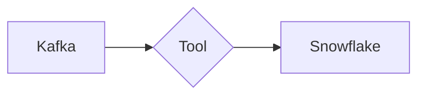

# Kafka-Snowflake (2025-04-17)

Report for the Kafka to Snowflake benchmark.



|                 |            |
|-----------------|------------|
| **Date**        | 2025-04-17 |
| **AWS Machine** | EC2 T2     |
| **Instance**    | t2.2xlarge |
| **vCPUs**       | 8          |
| **RAM**         | 32.0 GB    |
| **Region**      | us-east-1  |


<details>
<summary>Benchmark configuration <code>benchi.yml</code></summary>

```yaml
infrastructure:
  kafka:
    compose: ../../shared/kafka/compose.yml

tools:
  kafka-connect:
    compose:
      - ../../shared/kafka-connect/compose.yml
      - ./kafka-connect/compose.override.yml
  conduit:
    compose:
      - ../../shared/conduit/compose.yml
      - ./conduit/compose.override.yml

metrics:
  conduit_metrics:
    collector: conduit
    tools: conduit
    settings:
      url: http://localhost:8080/metrics
      pipelines: kafka-to-snowflake
  kafka_metrics:
    collector: kafka
    settings:
      url: http://localhost:7071/metrics
      topics: snowflake.test.users
  docker_metrics:
    collector: docker
    settings:
      containers:
        - benchi-conduit
        - benchi-kafka-connect

tests:
  - name: kafka-snowflake
    duration: 1m

    steps:
      pre-infrastructure:
      post-infrastructure:
        - name: "Kafka: Create topic"
          container: benchi-kafka
          run: /opt/kafka/bin/kafka-topics.sh --create --topic "snowflake.test.users" --partitions 1 --replication-factor 1 --bootstrap-server benchi-kafka:9092

      pre-tool:
      post-tool:
      pre-test:
        - name: "Conduit: Start pipeline"
          tools: conduit
          container: benchi-conduit
          run: |
            /benchi/scripts/install_tools.sh
            /benchi/scripts/start_pipeline.sh kafka-to-snowflake

        - name: "Kafka Connect: Start pipeline"
          tools: kafka-connect
          container: benchi-kafka-connect
          run: |
            /benchi/scripts/create_pipeline.sh /benchi/data/connector.json
            /benchi/scripts/await_connector_status.sh /benchi/data/connector.json RUNNING

      during:
        - name: "Kafka: Insert test data"
          container: benchi-kafka
          run: /benchi/scripts/insert_test_users.sh "snowflake.test.users" 1000000

      post-test:
      pre-cleanup:
      post-cleanup:
```

</details>

## Infrastructure

### Kafka

|                  |                      |
|------------------|----------------------|
| **Docker Image** | `apache/kafka:3.9.0` |

Kafka was configured as a single node cluster. See
[`compose.yml`](../../../shared/kafka/compose.yml) for the full container configuration.

<details>
<summary>Environment variables</summary>

```
KAFKA_PROCESS_ROLES="broker,controller"
KAFKA_NODE_ID="1"
KAFKA_CONTROLLER_QUORUM_VOTERS="1@benchi-kafka:9093"
KAFKA_LISTENERS="PLAINTEXT://:9092,CONTROLLER://:9093"
KAFKA_INTER_BROKER_LISTENER_NAME="PLAINTEXT"
KAFKA_ADVERTISED_LISTENERS="PLAINTEXT://benchi-kafka:9092,CONTROLLER://benchi-kafka:9093"
KAFKA_CONTROLLER_LISTENER_NAMES="CONTROLLER"
KAFKA_LISTENER_SECURITY_PROTOCOL_MAP="CONTROLLER:PLAINTEXT,PLAINTEXT:PLAINTEXT,SSL:SSL,SASL_PLAINTEXT:SASL_PLAINTEXT,SASL_SSL:SASL_SSL"
KAFKA_OFFSETS_TOPIC_REPLICATION_FACTOR="1"
```

</details>


### Snowflake

|                    |           |
|--------------------|-----------|
| **Cloud provider** | AWS       |
| **Region**         | us-east-2 |
| **Warehouse size** | Large     |

We used an empty Snowflake account with a fresh database.

## Results

### Aggregated

// TODO

### Conduit

|                     |                                                                                             |
|---------------------|---------------------------------------------------------------------------------------------|
| **Conduit version** | `v0.13.4`                                                                                   |
| **Connector**       | [`builtin:snowflake@v0.4.0`](https://github.com/conduitio-labs/conduit-connector-snowflake) |

See [`compose.yml`](../../../shared/conduit/compose.yml) for the full container
configuration.

<details>
<summary>Conduit configuration <code>conduit.yaml</code></summary>

```yaml
log.format: json
log.level: debug
preview.pipeline-arch-v2: true
```

</details>

<details>
<summary>Pipeline configuration <code>pipeline.yaml</code></summary>

```yaml
version: "2.2"
pipelines:
  - id: kafka-to-snowflake
    status: stopped
    processors:
      - id: parsingpayload
        plugin: "json.decode"
        settings:
          field: .Payload.After
      - id: fieldset
        plugin: "field.set"
        settings:
          field: .Key
          value: '{"id":"{{ .Payload.After.id }}"}'
      - id: parsingkey
        plugin: "json.decode"
        settings:
          field: .Key

    connectors:
      - id: kafka
        type: source
        plugin: kafka
        settings:
          servers: "benchi-kafka:9092"
          topics: "snowflake.test.users"
          readFromBeginning: "true"
          sdk.batch.delay: "1s"
          sdk.batch.size: 100000

          sdk.schema.context.enabled: "true"
          sdk.schema.context.name: ""
          sdk.schema.extract.key.enabled: "false"
          sdk.schema.extract.key.subject: "key"
          sdk.schema.extract.payload.enabled: "false"
          sdk.schema.extract.payload.subject: "payload"
          sdk.schema.extract.type: "avro"
      - id: snowflake
        type: destination
        plugin: "snowflake"
        settings:
          snowflake.host: ${SNOWFLAKE_HOST}
          snowflake.username: ${SNOWFLAKE_USERNAME}
          snowflake.password: ${SNOWFLAKE_PASSWORD}

          snowflake.schema: "public"
          snowflake.table: "conduit_test"
          snowflake.primaryKey: "id"

          snowflake.compression: "zstd"
          snowflake.format: "csv"
          snowflake.namingPrefix: "meroxa"
          snowflake.port: "0"
          snowflake.stage: "stage"
          snowflake.database: "BENCHI"
          snowflake.warehouse: "COMPUTE_WH"
```

</details>

### Kafka Connect

|                  |                                                 |
|------------------|-------------------------------------------------|
| **Docker Image** | `confluentinc/cp-kafka-connect:7.8.1`           |
| **Connector**    | `snowflakeinc/snowflake-kafka-connector:3.1.1`  |

See [`compose.yml`](../../../shared/kafka-connect/compose.yml) for the full container
configuration.

<details>
<summary>Environment variables</summary>

```
CONNECT_BOOTSTRAP_SERVERS="benchi-kafka:9092"
CONNECT_REST_ADVERTISED_HOST_NAME="benchi-kafka-connect"
CONNECT_REST_PORT="8083"
CONNECT_GROUP_ID="connect-cluster-group"
CONNECT_CONFIG_STORAGE_TOPIC="benchi-connect-configs"
CONNECT_CONFIG_STORAGE_REPLICATION_FACTOR="1"
CONNECT_OFFSET_FLUSH_INTERVAL_MS="10000"
CONNECT_OFFSET_STORAGE_TOPIC="benchi-connect-offsets"
CONNECT_OFFSET_STORAGE_REPLICATION_FACTOR="1"
CONNECT_STATUS_STORAGE_TOPIC="benchi-connect-status"
CONNECT_STATUS_STORAGE_REPLICATION_FACTOR="1"
CONNECT_PLUGIN_PATH="/usr/share/java,/usr/share/confluent-hub-components"
CONNECT_CONNECTIONS_MAX_IDLE_MS=180000
CONNECT_METADATA_MAX_AGE_MS=180000
CONNECT_AUTO_CREATE_TOPICS_ENABLE="true"
CONNECT_KEY_CONVERTER="org.apache.kafka.connect.json.JsonConverter"
CONNECT_VALUE_CONVERTER="org.apache.kafka.connect.json.JsonConverter"
CONNECT_LOG4J_LOGGERS="org.apache.zookeeper=ERROR,org.I0Itec.zkclient=ERROR,org.reflections=ERROR"
BENCHI_INIT_PATH="/benchi/init"
```

</details>

<details>
<summary>Connector configuration <code>connector.json</code></summary>

```json
{
    "name": "snowflake-sink",
    "config": {
        "connector.class": "com.snowflake.kafka.connector.SnowflakeSinkConnector",
        "tasks.max": "1",
        "topics": "snowflake.test.users",

        "snowflake.url.name": "${SNOWFLAKE_HOST}",
        "snowflake.user.name": "${SNOWFLAKE_USERNAME}",
        "snowflake.private.key": "${SNOWFLAKE_PRIVATE_KEY}",
        "snowflake.private.key.passphrase": "${SNOWFLAKE_PRIVATE_KEY_PASSPHRASE}",

        "snowflake.database.name": "benchi",
        "snowflake.schema.name": "public",
        "snowflake.table.name": "kafka_connect_test",
        "buffer.count.records": "10000",
        "buffer.size.bytes": "5000000",
        "buffer.flush.time": "60",
        "key.converter": "org.apache.kafka.connect.storage.StringConverter",
        "value.converter": "org.apache.kafka.connect.json.JsonConverter",
        "value.converter.schemas.enable": "false"
    }
}
```

</details>