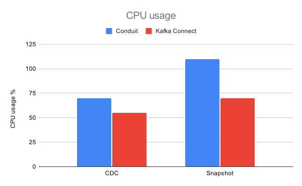
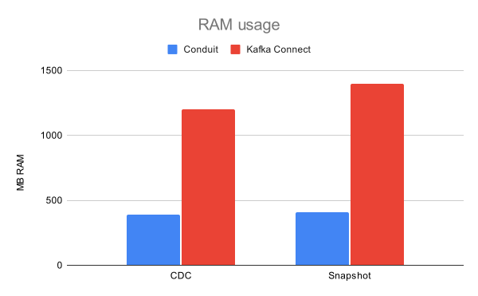
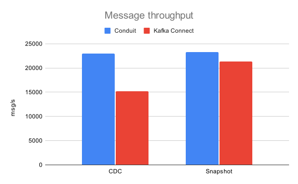

# Mongo-to-Kafka results

## Date of testing

April 22nd, 2025

## Setup

All of our tests were performed multiple times on a t2.xlarge AWS EC2 instance (
4 vCPUs, 16 GB RAM) with a 40 GB gp3 EBS volume. The infrastructure (Kafka and
MongoDB) was provided via Docker containers. We ran a single Kafka broker and a
three-member MongoDB replica set.

The configuration for snapshots and CDC tests can be
found [here](https://github.com/ConduitIO/streaming-benchmarks/blob/df8dc6f5dc05a48eb15ee3e9518d2080cf90210e/benchmarks/mongo-kafka-snapshot/benchi.yml)
and [here](https://github.com/ConduitIO/streaming-benchmarks/blob/df8dc6f5dc05a48eb15ee3e9518d2080cf90210e/benchmarks/mongo-kafka-cdc/benchi.yml).
Here are some notable configurations.

### Conduit

We tested Conduit v0.13.2 with the MongoDB connector v0.2.2. Conduit is run with
the [re-architectured pipeline engine](https://meroxa.com/blog/optimizing-conduit-5x-the-throughput/)
and has been modified to include the MongoDB connector as a built-in connector (
and not as a standalone). This increases performance and is also more similar to
how Kafka Connect connectors work (they are added to the classpath and run as
part of the Kafka Connect service). The pipeline configurations can be
found [here](https://github.com/ConduitIO/streaming-benchmarks/blob/df8dc6f5dc05a48eb15ee3e9518d2080cf90210e/benchmarks/mongo-kafka-cdc/conduit/pipeline.yml)
and [here](https://github.com/ConduitIO/streaming-benchmarks/blob/df8dc6f5dc05a48eb15ee3e9518d2080cf90210e/benchmarks/mongo-kafka-snapshot/conduit/pipeline.yml).
The option to automatically generate schemas has been turned off. We also turned
off compression in the Kafka destination connector (which is also done in Kafka
Connect).

### Kafka Connect

We tested Kafka Connect v7.8.1 with MongoDB’s Kafka connector v1.15.0. The Kafka
Connect worker uses the default settings. We utilize the MongoDB connector with
several custom configurations: schema inference is disabled, CDC returns the
complete document (rather than the default behavior of showing only differences
between original and updated documents), and we've adjusted the batch size. Full
connector configurations can be
found [here](https://github.com/ConduitIO/streaming-benchmarks/blob/df8dc6f5dc05a48eb15ee3e9518d2080cf90210e/benchmarks/mongo-kafka-snapshot/kafka-connect/data/connector.json)
and https://github.com/ConduitIO/streaming-benchmarks/blob/df8dc6f5dc05a48eb15ee3e9518d2080cf90210e/benchmarks/mongo-kafka-cdc/kafka-connect/data/connector.json.

## Running the benchmarks

The benchmarks can be run by cloning or downloading this repository and then
running: `make run-mongo-kafka-cdc` or `make run-mongo-kafka-snapshot`.

## Results

Here we present a comparison between Conduit and Kafka Connect, which includes
the message rates (for both, snapshot and CDC modes) as well as resource usage.
The charts below summarize results from 56 runs of CDC and snapshot tests.

Conduit’s CPU usage is higher by around 13% in snapshots and 28% in CDC. When it
comes to memory usage, we see a bigger gap, this time with Conduit using less
resources (390 MB or 68%) than Kafka Connect (1200 MB).

While the snapshot message rates are pretty close (Conduit’s message rate is
about 9% higher), we see a greater gap in CDC, where Conduit’s message rate is
about 52% higher. We believe this is a significant result, given that pipelines
will spend most of their time in CDC mode (a snapshot might take days, and the
rest of a pipeline’s life, even after restarts, will be spent on capturing data
changes).
