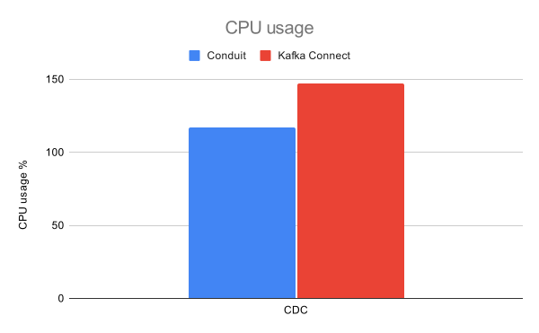
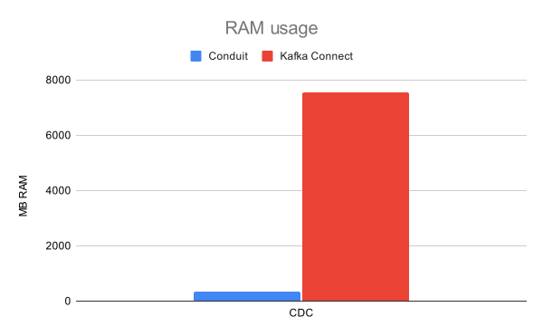
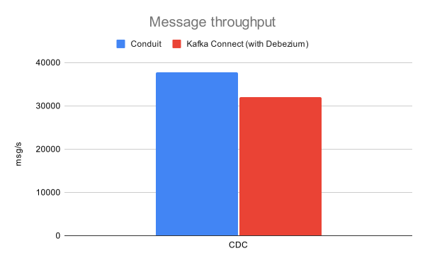

# Mongo-to-Kafka results

## Date of testing

April 28th, 2025

## Setup

All of our tests were performed multiple times on a c7i.2xlarge AWS EC2 instance (
8 vCPUs, 16 GB RAM) with a 40 GB gp3 EBS volume. The infrastructure (Kafka and
MongoDB) was provided via Docker containers. We ran a single Kafka broker and a
three-member MongoDB replica set.

The configuration for the CDC test can be
found [here](https://github.com/ConduitIO/streaming-benchmarks/blob/37a666ad97ff495465bd18e3c6d53b35b16bf5f1/benchmarks/mongo-kafka-cdc/benchi.yml).
Here are some notable configurations.

### Conduit

We tested Conduit v0.13.2 with the MongoDB connector v0.2.2. Conduit is run with
the [re-architectured pipeline engine](https://meroxa.com/blog/optimizing-conduit-5x-the-throughput/)
and has been modified to include the MongoDB connector as a built-in connector (
and not as a standalone). This increases performance and is also more similar to
how Kafka Connect connectors work (they are added to the classpath and run as
part of the Kafka Connect service). The pipeline configuration can be
found [here](https://github.com/ConduitIO/streaming-benchmarks/blob/37a666ad97ff495465bd18e3c6d53b35b16bf5f1/benchmarks/mongo-kafka-cdc/conduit/pipeline.yml).
The option to automatically generate schemas has been turned off. We also turned
off compression in the Kafka destination connector (which is also done in Kafka
Connect).

### Kafka Connect

We tested Kafka Connect v7.8.1 with Debezium's Mongo connector v3.1. The Kafka
Connect worker uses the default settings. Here are some notable configuration
changes that we made:

- schema inference is disabled
- CDC returns the complete document (rather than the default behavior of showing only differences
between original and updated documents)
- we've adjusted the batch size
- the Kafka Connect worker is given a heap of 10 GB.

Full connector configurations can be
found [here](https://github.com/ConduitIO/streaming-benchmarks/blob/37a666ad97ff495465bd18e3c6d53b35b16bf5f1/benchmarks/mongo-kafka-cdc/kafka-connect-dbz/data/connector.json).

## Running the benchmarks

The benchmarks can be run by cloning or downloading this repository and then
running: `make run-mongo-kafka-cdc`.

## Results

This section compares performance metrics between Conduit and Kafka Connect with
Debezium, examining message throughput and resource utilization during CDC
operations. The following charts illustrate results from our testing.

In CDC mode, Conduit demonstrates 17% higher message throughput (37,692 msg/s
versus 32,080 msg/s). Regarding resource consumption, Conduit utilizes less
CPU (117% versus 147%) and significantly less memory—only 350 MB compared to
Kafka Connect's 7,560 MB, representing a 95% reduction in memory requirements.
