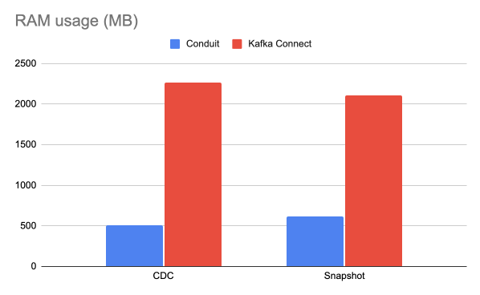
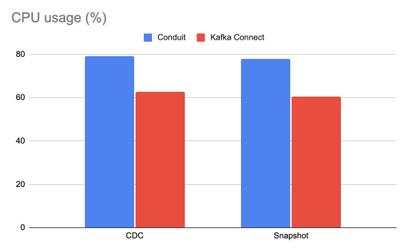
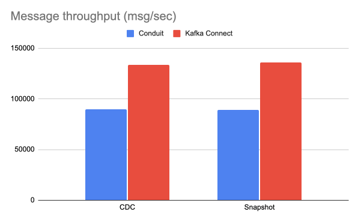

# MySQL-to-Kafka results

## Date of testing

May 7th, 2025

## Setup

All of our tests were performed multiple times on EC2, instance types: **c7a.large**, and **c7a.xlarge**,
each provisioned with **40**GB gp3 EBS volume. The infrastructure (Kafka and
MySQL) was provided via Docker containers.

We ran a single Kafka broker and a
MySQL database instance. The configurations for the benchmarks can be found
[here](../../../../benchmarks/mysql-kafka-snapshot/benchi.yml) and
[here](../../../../benchmarks/mysql-kafka-cdc/benchi.yml).

### Conduit

We tested Conduit v0.13.2 with a builtin MySQL connector. Conduit was run with the
[re-architectured pipeline engine](https://meroxa.com/blog/optimizing-conduit-5x-the-throughput/) with this [configuration](../../../../shared/conduit/conduit.yaml).

The pipelines used can be found
[here](../../../../benchmarks/mysql-kafka-snapshot/conduit/pipeline.yml) and
[here](../../../../benchmarks/mysql-kafka-cdc/conduit/pipeline.yml).

### Kafka Connect
debezium/debezium-connector-mysql:2.4.2
We tested Kafka Connect with the Debezium MySQL connector v2.4.2. Full connector configurations can be
found [here](../../../../benchmarks/mysql-kafka-snapshot/kafka-connect/data/connector.json) and
[here](../../../../benchmarks/mysql-kafka-cdc/kafka-connect/data/connector.json).

## Running the benchmarks

The benchmarks can be run by cloning or downloading this repository and then
running: `make run-mysql-kafka-cdc` or `make run-mysql-kafka-snapshot`.

## Results

The results of the benchmarks are summarized below. Detailed results can be
found in the `.csv` files under the `results/mysql-kafka/20250507` directory.

## Test #1
Using the EC2 instance **c7a.large**, 40GB (2 vCPU, 4 GiB RAM).
### Results

| Mode         | Tool           | Message Rate (msg/s) | CPU % | Memory (MB) |
|:-------------|:---------------|---------------------:|------:|------------:|
| **CDC**      | Conduit        |             63,414.1 |    70 |        45.2 |
|              | Kafka Connect* |                  N/A |   N/A |         N/A |
| **Snapshot** | Conduit        |             63,806.6 |  69.5 |        45.3 |
|              | Kafka Connect* |                  N/A |   N/A |         N/A |

\* _Kafka Connect couldn’t even start due to **insufficient resources**._

## Test #2

Using the EC2 instance **c7a.xlarge**, 40GB: (4 vCPU, 8 GiB RAM).

### Results

| Mode         | Tool          | Message Rate (msg/s) | CPU % |   Memory (MB) |
|:-------------|:--------------|---------------------:|------:|--------------:|
| **CDC**      | Conduit       |            89,873.13 | 79.15 |        503.17 |
|              | Kafka Connect |           133,663.32 | 62.70 | ***2,267.48** |
| **Snapshot** | Conduit       |            89,300.70 | 77.92 |        620.43 |
|              | Kafka Connect |           135,733.00 | 60.56 | ***2,109.31** |

\* Kafka Connect is using over 2GB of resources, more than **4 times** what Conduit needed.

### Charts

 
 

 
 

 

## Summary
Across all tested EC2 instance types, from low-resource to high-resource environments, 
**Conduit consistently proves to be a lean, reliable, and production-ready tool** for 
MySQL to Kafka pipeline.

- On **c7a.large**, ***Kafka Connect couldn’t even start***, while Conduit ran smoothly,
delivering solid throughput with minimal resource usage.
- On **c7a.xlarge**, Kafka Connect achieved higher throughput, but Conduit held close,
using **~75% less memory** while maintaining competitive performance. Even though Conduit
used more CPU (around 80% vs Kafka Connect’s 60%), it did so **intentionally and efficiently**,
making better use of available system resources.